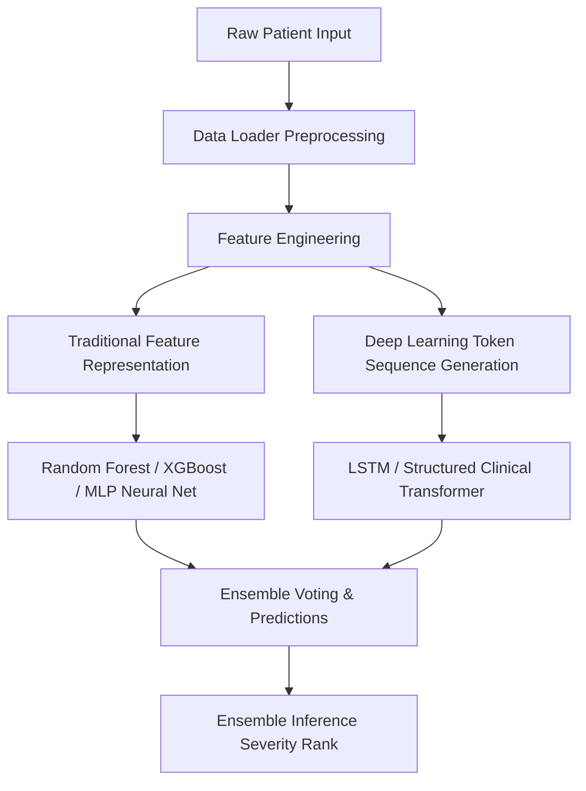

# Veterinary Health Assessment System

An AI-powered clinical veterinary decision support system that uses ensemble machine learning to predict animal health risks based on demographics, clinical measurements, and symptom profiles. The system is designed to identify high-risk ("Dangerous") cases and generate professional recommendations using LLMs.

---

## 📋 Table of Contents
1. [Description](#-description)
2. [Dataset Information](#-dataset-information)
3. [Code Information](#-code-information)
4. [Methodology](#-methodology)
5. [Requirements & Dependencies](#-requirements--dependencies)
6. [Usage Instructions](#-usage-instructions)
7. [Work in Progress (WIP) Multimodal Features](#-work-in-progress-wip-multimodal-features)
8. [Citations](#-citations)
9. [License & Contribution Guidelines](#-license--contribution-guidelines)

---

## 🎯 Description

The **Veterinary Health Assessment System (VHAS)** is a machine learning platform designed to assist veterinary clinical decisions. It performs real-time severity assessment on animals by checking clinical profiles (species, breed, age, and weight) and symptoms sequences. 

The core predictive engine leverages an ensemble of machine learning classifiers (Random Forest, XGBoost, Multi-Layer Perceptron) along with deep learning configurations (LSTM and a Structured Clinical Transformer) to flag whether a patient requires immediate emergency intervention ("Dangerous" status) or routine care.

---

## 📊 Dataset Information

The system utilizes a programmatically simulated dataset containing clinical histories for **30,000 veterinary patients**. The simulation uses veterinary clinical priors to ensure realistic demographic vulnerabilities and symptom correlations.

### Patient Cohorts (15 Animal Species)
- **Companion Animals**: Dog, Cat, Rabbit, Parrot, Hamster, Guinea pig, Turtle
- **Livestock & Equine**: Cow, Horse, Goat, Sheep, Pig, Chicken, Duck, Turkey
- **Breeds**: Breed-specific vulnerabilities are modeled for key breeds (e.g., Bulldogs, Persians, Arabians).

### Dataset Schema
Each patient record is represented by the following clinical attributes:
- `AnimalName`: Species of the animal (categorized, lowercased).
- `Breed`: Specific breed mapped under the animal class.
- `Age`: Demographics category (`young`, `adult`, `senior`).
- `Weight`: Body weight in kg (continuous scale; 1.0 to 500.0 kg).
- `Symptom_1` to `Symptom_10`: Active symptoms displayed by the patient. The system supports up to 10 active symptoms (padded with `'none'`).
- `Symptom_Count`: The total active symptom count.
- `Dangerous`: Direct target classification label (`Yes` / `No`) indicating if the condition is life-threatening.
- `Danger_Score`: Continuous score (0.0 to 1.0) indicating overall risk.

### Symptom Severity and Prior Interactions
The simulation incorporates specific clinical heuristics:
- **High-Severity Prior Weights**: Seizures (0.95), Unconsciousness (0.95), Coma (0.95), Bleeding (0.90), Paralysis (0.92), Resipratory Distress (0.85).
- **Symptom Clusters**: Grouped into Neurological, Respiratory, Gastrointestinal, Systemic, and Dermatological clusters.
- **Interactions**: Having multiple symptoms within the same cluster (e.g. `vomiting` + `diarrhea` + `abdominal_pain` for Gastrointestinal) boosts the overall risk score mathematically.
- **Demographic Vulnerability**: Senior animals have a risk uplift of 0.12, young animals have 0.06, and weight extremes (<2kg or >300kg) add 0.04 to the danger calculation.

---

## 💻 Code Information

The implementation is structured logically across modular python components:

### Main Files
* [app.py](file:///c:/Users/abhay/OneDrive/Desktop/Vetenary-Project/app.py): The Streamlit web interface containing the input builder, real-time risk scores dashboard, model analytics, and AI veterinary report generation using OpenAI.
* [run_app.py](file:///c:/Users/abhay/OneDrive/Desktop/Vetenary-Project/run_app.py): Helper script to set up environmental paths and run the Streamlit interface.
* [train_models.py](file:///c:/Users/abhay/OneDrive/Desktop/Vetenary-Project/train_models.py): Pipeline script to generate the 30,000 sample simulated dataset, perform preprocessing, execute feature engineering, train all models (RF, MLP, XGBoost, SCT, LSTM), and persist weights.
* [setup.py](file:///c:/Users/abhay/OneDrive/Desktop/Vetenary-Project/setup.py): Basic installation/distribution configuration.

### Source Files (`src/`)
* [config.py](file:///c:/Users/abhay/OneDrive/Desktop/Vetenary-Project/src/config.py): Configuration file containing lists of supported species, breeds, and 80+ clinical symptoms.
* [data_loader.py](file:///c:/Users/abhay/OneDrive/Desktop/Vetenary-Project/src/data_loader.py): Dynamic data generator that builds patient simulation profiles and handles standard LabelEncoding / normalization.
* [feature_engineer.py](file:///c:/Users/abhay/OneDrive/Desktop/Vetenary-Project/src/feature_engineer.py): Performs data preparation for model inputs, creates cluster-level indicators, counts symptoms, and constructs mapped sequence tensors for deep learning networks.
* [models.py](file:///c:/Users/abhay/OneDrive/Desktop/Vetenary-Project/src/models.py): Defines the neural network architectures:
  - **Veterinary LSTM**: Captures sequence relationships in symptom order.
  - **Structured Clinical Transformer (SCT)**: Applies self-attention layers on padded symptom list tokens plus demographic embeddings.
* [trainer.py](file:///c:/Users/abhay/OneDrive/Desktop/Vetenary-Project/src/trainer.py): Custom trainer classes incorporating early stopping, learning rate scheduling, and binary cross-entropy optimization for PyTorch models.

---

## 🔬 Methodology

The system uses a multi-tier learning approach to map unstructured symptoms list and structured demographic factors to veterinary assessments:



### Steps taken:
1. **Simulation**: Generates animal characteristics (breed, age, weight) and assigns symptoms based on correlation matrices.
2. **Preprocessing**: Normalizes numerical features (weight) and encodes labels (animal type, breed, age group).
3. **Feature Engineering**: Calculates severity scores, maps sequence symptoms onto numerical tokens, and derives specific diagnostic indicators.
4. **Modeling**:
   - **XGBoost & RandomForest**: Map demographic features and symptom presence matrices.
   - **SCT (Structured Clinical Transformer)**: Passes symptom embeddings, animal embeddings, breed embeddings, and age embeddings through Multi-Head Attention blocks to predict patient vulnerability.
5. **Inference & UI Display**: Generates danger labels in front end and triggers GPT API to synthesize veterinary advice when high risks are discovered (the "Supremacy Rule").

---

## 🛠️ Requirements & Dependencies

To set up the project environment, install the standard libraries specified in [requirements.txt](file:///c:/Users/abhay/OneDrive/Desktop/Vetenary-Project/requirements.txt):

- **Deep Learning**: `torch>=2.0.0`, `transformers>=4.30.0`
- **Machine Learning**: `scikit-learn>=1.2.0`, `xgboost>=1.7.0`
- **Data Engineering**: `pandas>=1.5.0`, `numpy>=1.21.0`, `joblib>=1.2.0`
- **Dashboard & Visualization**: `streamlit>=1.28.0`, `plotly>=5.13.0`, `matplotlib>=3.5.0`, `seaborn>=0.12.0`
- **Generals**: `tqdm>=4.65.0`, `python-dotenv>=1.0.0`, `requests>=2.28.0`

---

## 🚀 Usage Instructions

### 1. Setup the Environment
Clone the repository and install all dependencies:
```powershell
pip install -r requirements.txt
```

### 2. Generate Dataset & Train Models
To run the full simulator and train the traditional and deep learning ensembles:
```powershell
python train_models.py
```
This script will output the training process, compare model metrics, and save model binaries (`.joblib`, `.pth`) to a local `models/` directory.

### 3. Launch the Web Application
Start the Streamlit client to run animal assessments interactively:
```powershell
python run_app.py
```
Or directly:
```powershell
streamlit run app.py
```

---

## 🚧 Work in Progress (WIP) Multimodal Features

We are currently integrating multimodal diagnostic aids to work alongside the tabular health assessment system. These components are currently in the **Experimental / Work in Progress** phase inside [train_multimodal_models.py](file:///c:/Users/abhay/OneDrive/Desktop/Vetenary-Project/train_multimodal_models.py):

* 🎬 **Video Gait Analysis**: Uses MediaPipe to track skeletal coordinates and animal poses from videos to identify lameness, joint anomalies, or locomotion discomfort.
* 🌡️ **Thermal Imaging**: Identifies local thermal abnormalities and inflammatory regions (e.g., cow mastitis, horse lameness) via infrared veterinary photographs.
* 🎵 **Vocal Stress Detection**: Analyzes audio animal calls (such as barking or vocal patterns) to identify acoustic stress indicators (pitch shifts, frequency abnormalities).

Install optional dependencies from `requirements_multimodal.txt` to run multimodal feature extraction experiments.

---

## 📚 Citations

If this project or dataset is utilized in research, please cite the following:
```text
@software{vhas2026,
  author = {Abhay, Ajay},
  title = {Veterinary Health Assessment System (VHAS)},
  year = {2026},
  url = {https://github.com/AbhayAjay2803/Vetenary-Project1}
}
```

---

## 📄 License & Contribution Guidelines

### License
This project is licensed under the MIT License - see the `LICENSE` file for details.

### Contribution Guidelines
1. Fork the project repository.
2. Create your Feature Branch: `git checkout -b feature/NewHeuristic`
3. Commit your changes: `git commit -m 'Add custom symptom priors'`
4. Push to the Branch: `git push origin feature/NewHeuristic`
5. Open a Pull Request.
